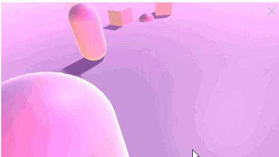
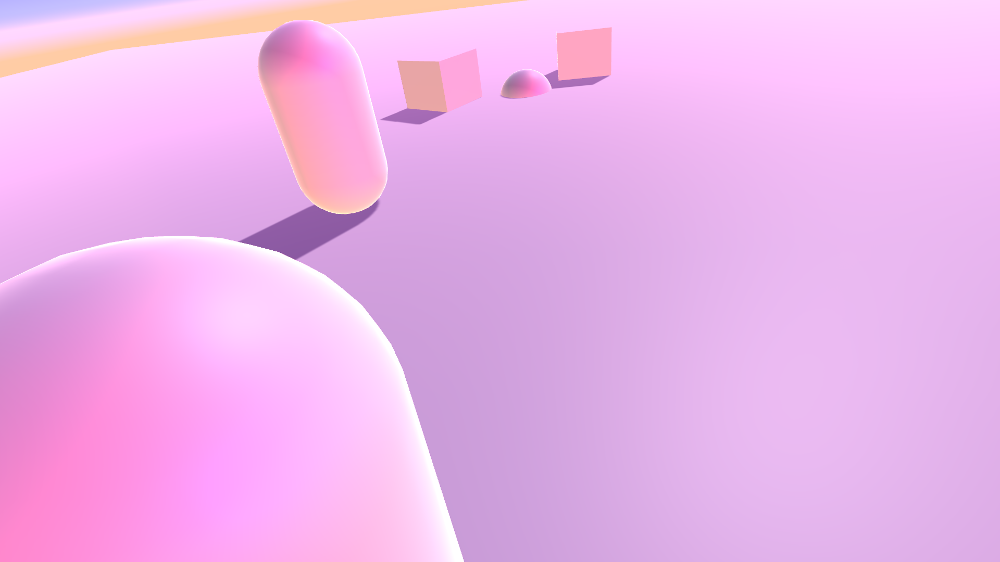
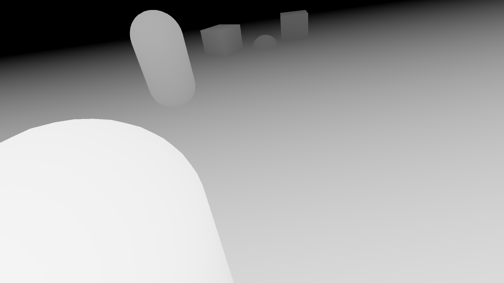

# Depth Capture

## Purpose
Facebook allows you too upload a "3d Photo" by uploading a depth map alongside an image.  Depth Map must be named `[IMAGENAME]_depth`.  This very bare bones project has a set of scripts + a shader to allow users to take a 3D screenshot at runtime.

## Basic Usage
 - Ensure your Game Window is running at a reasonably high resolution.  
 - Attach `CaptureScreenShot.cs` to an object in your scene, and attach `DepthImageEffect.cs` to your camera.  Ensure you assign the `DepthImageEffect` component to the CaptureScreenShot Component's `m_depth` property.
 - Choose a reasonable Far Plane distance.  You can test this at runtime by enabled the image effect and tweaking the camera's far plane. You want a reasonable gradation of value (contrast gives the effect).  Once the Far plane value is solid, set `targetFar` on the `CaptureScreenShot` to the ideal value.
 - At runtime, hit `space` to generate both textures into the Assets folder.
 - Upload both textures to Facebook as normal photos -> Facebook identifies the depth texture and generates the 3D photo automatically!

## Notes
Obviously this was very hastily thrown together, but it gets the job done.  Hopefully it serves as a great starting point, but don't expect a lot!
